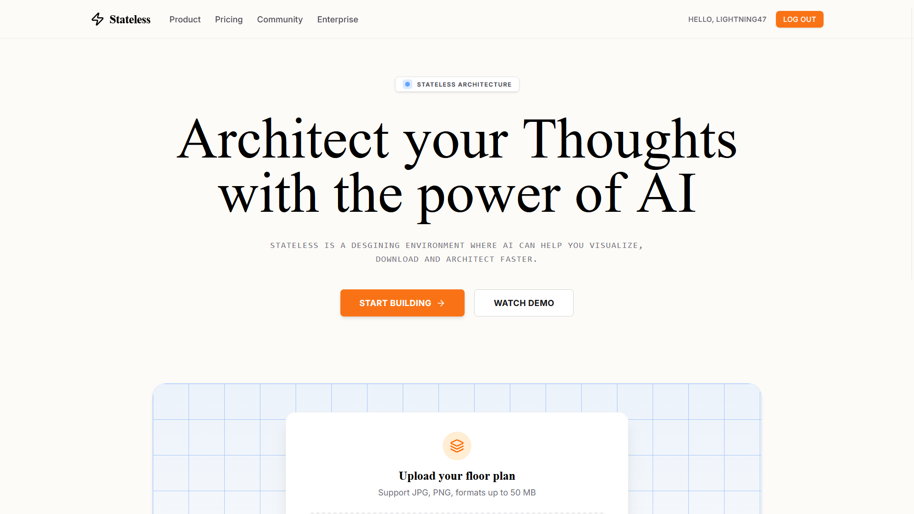

# Stateless

Architect your Thoughts with the power of AI.

**Live on: [puter.com/app/stateless](https://puter.com/app/stateless)**

**Stateless** is a designing environment where AI helps you visualize, download, and architect faster. Transform your flat 2D floor plans into immersive 3D visualizations, refine your designs, and share them with the community.

 

## 🚀 Features

- **AI-Powered Visualization**: Upload floor plans and generate stunning 3D renders.
- **Interactive Comparison**: Use the slider to compare original and generated designs side-by-side.
- **Project Management**: Save, view, and manage your design projects securely.
- **Privacy Controls**: Keep designs private or share them publicly with the Stateless community.
- **Export & Download**: Download your high-resolution renders anytime.
- **Responsive Design**: Works on desktop and mobile.

## 🛠️ Tech Stack

- **Frontend Framework**: React 19, React Router v7
- **Styling**: Tailwind CSS v4, Lucide React (Icons)
- **Backend Infrastructure**: [Puter.js](https://puter.com) (Workers, KV Store, Auth)
- **Comparison Tool**: `react-compare-slider`

## 🏁 Getting Started

### Prerequisites

- Node.js 18+ installed.
- A free [Puter.com](https://puter.com) account for backend functionality.

### Installation

1. Clone the repository:
   ```bash
   git clone https://github.com/lightning4747/Stateless.git
   cd Stateless
   ```

2. Install dependencies:
   ```bash
   npm install
   ```

3. Configure Environment Variables:
   - Create a `.env.local` file in the root directory.
   - Add your Puter Worker URL (see [Backend Setup](docs/BACKEND_SETUP.md)).
   ```env
   VITE_PUTER_WORKER_URL="https://your-worker-id.puter.work"
   ```

4. Run the development server:
   ```bash
   npm run dev
   ```

5. Open your browser at `http://localhost:5173`.

## 📖 Documentation

- [Backend Setup (Puter Worker)](docs/BACKEND_SETUP.md) - Instructions for setting up the backend logic.
- [Environment Variables](docs/ENV_VARS.md) - Details on required configuration.

## 🤝 Contributing

This is currently a solo hobby project by **lightning4747**. If you find a bug or have a feature request, please [open an issue](https://github.com/lightning4747/Stateless/issues).

## 📄 License

MIT